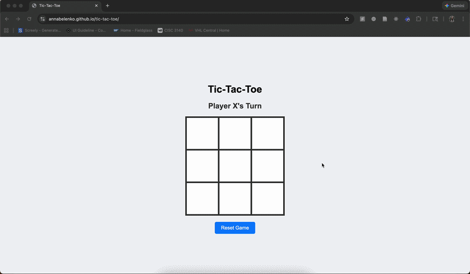

# Tic-Tac-Toe Game

A classic tic-tac-toe game built with HTML, CSS, and JavaScript. Clean, responsive design with smooth gameplay.

## 🎮 Demo



[**Play Live Demo**](https://annabelenko.github.io/tic-tac-toe)

## ✨ Features

- **Clean UI**: Modern, responsive design
- **Interactive Gameplay**: Click-to-play with hover effects
- **Win Detection**: Automatic detection of wins and draws
- **Game Reset**: Reset button to start a new game
- **Turn Indicator**: Clear display of current player's turn
- **Mobile Friendly**: Responsive design works on all devices

## 🎯 How to Play

1. The game starts with Player X
2. Click on any empty cell to place your mark
3. Players alternate turns (X and O)
4. First player to get 3 marks in a row (horizontal, vertical, or diagonal) wins
5. If all cells are filled without a winner, it's a draw
6. Click "Reset Game" to play again

## 🚀 Live Demo

This game is deployed on GitHub Pages: [Play Now](https://annabelenko.github.io/tic-tac-toe)

## 💻 Run Locally

1. Clone this repository:
   ```bash
   git clone https://github.com/annabelenko/tic-tac-toe.git
   ```

2. Navigate to the project directory:
   ```bash
   cd tic-tac-toe
   ```

3. Open `index.html` in your web browser or use a local server:
   ```bash
   # Using Python
   python -m http.server 8000
   
   # Using Node.js
   npx serve .
   
   # Or simply open the file
   open index.html
   ```

## 🛠️ Technologies Used

- **HTML5**: Structure and layout
- **CSS3**: Styling and responsive design
- **JavaScript**: Game logic and interactivity

## 📁 Project Structure

```
tic-tac-toe/
├── index.html        # Main HTML file
├── tictactoe.css     # Styles
├── tictactoe.js      # Game logic
└── README.md         # Project documentation
```

## 🎨 Game Logic

The game implements:
- 3x3 grid represented as an array
- Win condition checking for all possible combinations
- Turn switching between X and O players
- Game state management (active/inactive)
- Draw detection when board is full

## 👤 Author

**Anna Belenko**
- GitHub: [@annabelenko](https://github.com/annabelenko)

---

⭐ Star this repository if you found it helpful!